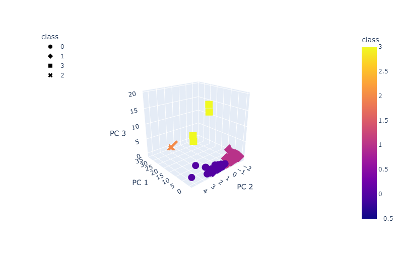
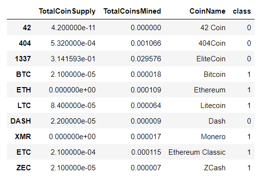

# Cryptocurrency Analysis

This project involved analyzing a cryptocurrency dataset from [CryptoCompare](https://min-api.cryptocompare.com/data/all/coinlist) on the algorithms, proof types, total coins mined and coin supply of a variety of cryptocurrencies. 

The goal was to use unsupervised machine learning to develop a classification system for future investments. The data was preprocessed extensively before Principal Component Analysis was performed to reduce the dimensions involved. After this was completed, an elbow curve was created to find the best value for K. This was then used in a K-means algorithm applied to the data to group the cryptocurrencies. It was then visualized in a 3-Dimensional scatter plot and a table, as shown below.     

 
	
 	